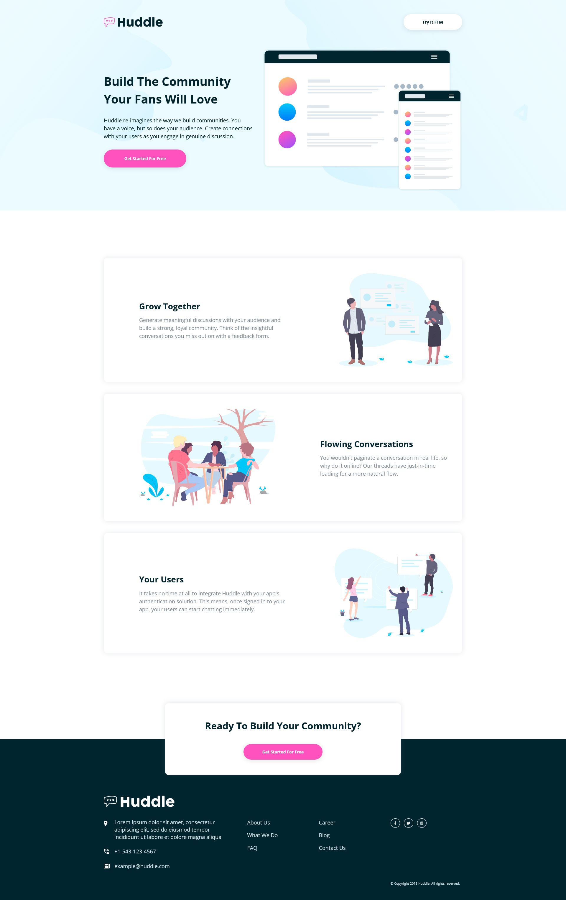
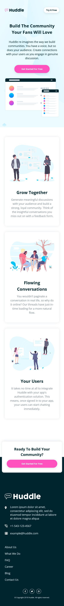

# Frontend Mentor - Huddle landing page with alternating feature blocks solution

This is a solution to the [Huddle landing page with alternating feature blocks challenge on Frontend Mentor](https://www.frontendmentor.io/challenges/huddle-landing-page-with-alternating-feature-blocks-5ca5f5981e82137ec91a5100). Frontend Mentor challenges help you improve your coding skills by building realistic projects.

## Table of contents

- [Overview](#overview)
  - [Screenshot](#screenshot)
  - [Links](#links)
- [My process](#my-process)
  - [Built with](#built-with)
  - [What I learned](#what-i-learned)
- [Author](#author)

## Overview

Hi! This is my attempt at the Huddle landing page (with alternating feature blocks). I broke down my attempt at the challenge and worked on each section (the navbar, hero, main sections and footer) and style each before then fine-tuning and working on the responsive layout for the entire page. I found using SCSS to be very convenient when modularising my styling into an organised file structure. It thus made my code much cleaner and less cluttered.

This challenge was fairly straightforward and simple, and the tricky part was getting the responsive layout down so all components looked clean and not mashed together on small screen sizes.

### Screenshot

Desktop

Mobile

### Links

- Solution URL: [Here!](https://github.com/sheronimo/frontendmentor-huddlelanding-alt)
- Live Site URL: [Here!](https://sheronimo.github.io/frontendmentor-huddlelanding-alt/)

## My process

1. I first imported the design images into Photoshop and then sketched out the different element and font sizes, padding and margin units.
2. I then restructured the markup one section at a time, also working on the styling before moving on to the markup for the next section.
3. I then fine-tuned the layout of each section, then worked on the overall responsive layout.

### Built with

- Semantic HTML5
- Flexbox
- Grid
- SCSS

### What I learned

I learned about how to better work with SCSS to write cleaner and less cluttered styling.

## Author

- Github - [sheronimo](https://github.com/sheronimo)
- Frontend Mentor - [@sheronimo](https://www.frontendmentor.io/profile/sheronimo)
